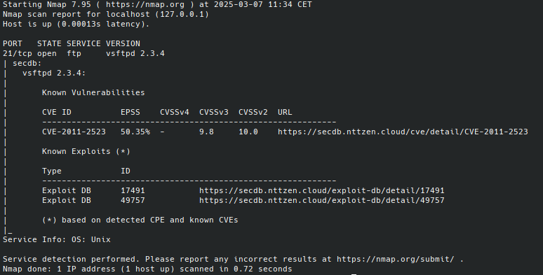

# SecDB Nmap plugin

## Description

SecDB Nmap plugin retrieves known vulnerability, exploit and advisory information from the ZEN SecDB Portal (https://secdb.nttzen.cloud) from services detected by Nmap.

## Getting started

    nmap -sV --script secdb [--script-args secdb.mincvss=<score>,secdb.url=<url>] <target>

**NOTE:** The script depends on having software versions at hand, so it only works with `-sV` flag.

The output of the Nmap is like the following:

### Arguments

| Argument        | Description                                             |
|-----------------|---------------------------------------------------------|
| `secdb.mincvss` | Filters out vulnerabilities with a CVSS score or higher |
| `secdb.url`     | Specify SecDB URL (default https://secdb.nttzen.cloud)  |

## Installation

* Locate where your nmap scripts are located on your system:
  - for *nix system it might be `~/.nmap/scripts/` or `$NMAPDIR`
  - for Mac it might be `/usr/local/Cellar/nmap/<version>/share/nmap/scripts/`
  - for Windows it might be `C:\Program Files (x86)\Nmap\scripts`
* Copy the `secdb.nse` script into that directory.
* Run `nmap --script-updatedb` to update the Nmap script DB 

### Dependencies

SecDB Nmap plugin uses these Nmap libraries:

- http
- json
- string
- table
- nmap
- stdnse

